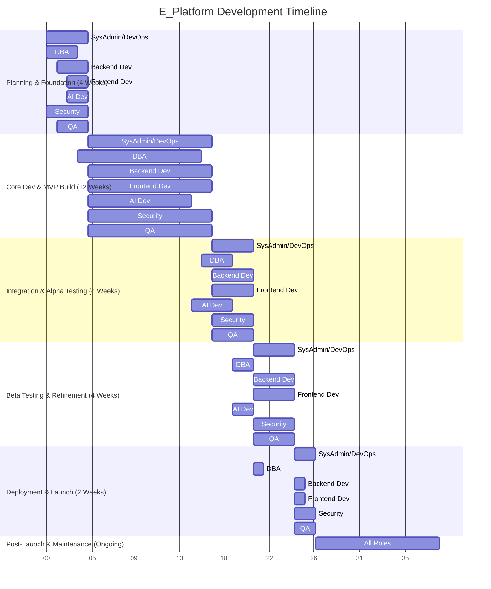

**Project Overview:** E_Platform - Educational platform with Django, Channels, Nginx, Redis, PostgreSQL. Features include AI elements, real-time communication, and content management.

**Overall Project Phases:**

1.  **Phase 1: Planning & Foundation (Weeks 1-4)**
2.  **Phase 2: Core Development & MVP Build (Weeks 5-16)**
3.  **Phase 3: Integration & Alpha Testing (Weeks 17-20)**
4.  **Phase 4: Beta Testing & Refinement (Weeks 21-24)**
5.  **Phase 5: Deployment & Launch (Weeks 25-26)**
6.  **Phase 6: Post-Launch & Maintenance (Ongoing)**

---

## High-Level Interaction Diagram (Simplified Gantt)

This diagram shows a conceptual overlap of phases and how roles might engage. Specific task dependencies are detailed in individual roadmaps.



---

## Role-Specific Roadmaps

### 1. System Administrator / DevOps Engineer

**Goal:** Ensure stable, scalable, and automated infrastructure for development, testing, and production.

```mermaid
graph TD
    A[P1: Planning & Setup] --> B(P2: CI/CD & Environment Dev)
    B --> C(P3: Staging & Pre-Prod Setup)
    C --> D(P4: Performance Tuning & Security Hardening)
    D --> E(P5: Production Deployment)
    E --> F(P6: Monitoring & Maintenance)

    subgraph P1 [Phase 1: Planning & Foundation (Weeks 1-4)]
        T1_1[Define Infra Requirements - 3d]
        T1_2[Cloud Provider Selection/Setup - 5d]
        T1_3[Basic Network Config (VPC, Subnets) - 3d]
        T1_4[Source Control Setup (Git) - 2d]
        T1_5[Initial CI/CD Tool Selection & Basic Setup - 5d]
    end

    subgraph P2 [Phase 2: Core Development & MVP Build (Weeks 5-16)]
        T2_1[Dev/Test Env Provisioning (VMs/Containers) - 1w]
        T2_2[Install Nginx, PostgreSQL, Redis (Dev/Test) - 1w]
        T2_3[Build Initial CI Pipeline (Build, Basic Test) - 2w]
        T2_4[Build Initial CD Pipeline (Deploy to Dev/Test) - 2w]
        T2_5[Setup Basic Monitoring & Logging (Dev/Test) - 1w]
        T2_6[Containerization Strategy (Docker) - 1w]
        T2_7[Implement Backup Strategy (Dev/Test DBs) - 1w]
    end

    subgraph P3 [Phase 3: Integration & Alpha Testing (Weeks 17-20)]
        T3_1[Staging Environment Provisioning - 1w]
        T3_2[Deploy Application to Staging - 3d]
        T3_3[Configure Nginx for Staging (SSL, Load Balancing POC) - 1w]
        T3_4[Integrate Monitoring & Logging for Staging - 1w]
    end

    subgraph P4 [Phase 4: Beta Testing & Refinement (Weeks 21-24)]
        T4_1[Pre-Production Environment Setup (mirroring Prod) - 1w]
        T4_2[Load Testing Infrastructure Setup & Support - 1w]
        T4_3[Infrastructure Security Hardening (with Security Spec.) - 1w]
        T4_4[Refine CI/CD for Production - 1w]
    end

    subgraph P5 [Phase 5: Deployment & Launch (Weeks 25-26)]
        T5_1[Production Environment Provisioning - 1w]
        T5_2[Production Nginx, PostgreSQL, Redis Setup & Config - 3d]
        T5_3[Execute Production Deployment Plan - 2d]
        T5_4[Implement Production Monitoring & Alerting - 2d]
        T5_5[Finalize Backup & Disaster Recovery Plan - 2d]
    end

    subgraph P6 [Phase 6: Post-Launch & Maintenance (Ongoing)]
        T6_1[Monitor System Performance & Availability - Ongoing]
        T6_2[Manage Backups & Restore Drills - Ongoing]
        T6_3[Patch Management & Security Updates - Ongoing]
        T6_4[Scale Infrastructure as Needed - Ongoing]
        T6_5[CI/CD Pipeline Maintenance & Optimization - Ongoing]
    end
```

*   **Timeline & Phases:** As per graph.
*   **Specific Tasks & Time:** As per graph.
*   **Key Dependencies:**
    *   Backend Dev: Application code to deploy.
    *   DBA: Database connection details, schema info for backups.
    *   Security Specialist: Security requirements, hardening guidelines.
    *   QA: Environments for testing.
*   **Critical Milestones:**
    *   M1: Dev environment ready. (Unblocks Backend/Frontend)
    *   M2: CI/CD pipeline operational for Dev/Test.
    *   M3: Staging environment deployed and accessible.
    *   M4: Production environment ready.
    *   M5: Successful production deployment.
*   **Required Skills & Tools:**
    *   Linux, Nginx, PostgreSQL, Redis administration.
    *   Cloud platforms (AWS, Azure, GCP).
    *   CI/CD tools (Jenkins, GitLab CI, GitHub Actions).
    *   Containerization (Docker, Kubernetes - optional for MVP).
    *   Infrastructure as Code (Terraform, Ansible).
    *   Monitoring tools (Prometheus, Grafana, ELK stack).
    *   Scripting (Bash, Python).
*   **Common Challenges & Mitigation:**
    *   **Challenge:** Environment drift. **Mitigation:** IaC, automated configuration.
    *   **Challenge:** CI/CD pipeline complexity. **Mitigation:** Start simple, iterate, use managed services if possible.
    *   **Challenge:** Downtime during deployment. **Mitigation:** Blue/Green or Canary deployment strategies.
*   **Acceptance Criteria for Major Deliverables:**
    *   **Dev Environment Ready:** Developers can deploy and run the application. Basic logging available.
    *   **CI/CD Operational:** Code pushed to main branch automatically builds and deploys to dev environment.
    *   **Production Deployment Successful:** Application is live, accessible, monitored, and backed up. Key performance indicators (KPIs) within acceptable limits.

---

### 2. Database Administrator (PostgreSQL)

**Goal:** Ensure database integrity, performance, security, and availability.

```mermaid
graph TD
    DBA_A[P1: Planning & Design] --> DBA_B(P2: Schema Dev & Optimization)
    DBA_B --> DBA_C(P3: Staging Setup & Data Migration Prep)
    DBA_C --> DBA_D(P4: Performance Tuning & Backup Validation)
    DBA_D --> DBA_E(P5: Production DB Setup & Migration)
    DBA_E --> DBA_F(P6: Ongoing Maintenance & Optimization)

    subgraph DBA_P1 [Phase 1: Planning & Foundation (Weeks 1-3)]
        DBA_T1_1[Gather Data Requirements (with Backend/AI) - 3d]
        DBA_T1_2[Initial Data Model Design (ERD) - 5d]
        DBA_T1_3[Define Backup & Recovery Strategy - 3d]
        DBA_T1_4[Define Security Policies (Users, Roles, Permissions) - 2d]
    end

    subgraph DBA_P2 [Phase 2: Core Development & MVP Build (Weeks 4-15)]
        DBA_T2_1[Install & Configure PostgreSQL for Dev/Test (with DevOps) - 3d]
        DBA_T2_2[Create Initial MVP Schema & Tables - 1w]
        DBA_T2_3[Implement User Roles & Permissions - 1w]
        DBA_T2_4[Develop Initial Stored Procedures/Functions (if needed) - 2w]
        DBA_T2_5[Advise Backend on Query Optimization - Ongoing (2w effort)]
        DBA_T2_6[Schema Evolution for new features - Ongoing (3w effort)]
    end

    subgraph DBA_P3 [Phase 3: Integration & Alpha Testing (Weeks 16-18)]
        DBA_T3_1[Setup Staging Database (with DevOps) - 3d]
        DBA_T3_2[Develop Data Migration Scripts (Dev to Staging) - 1w]
        DBA_T3_3[Test Data Migration to Staging - 3d]
        DBA_T3_4[Initial Performance Benchmarking on Staging - 1w]
    end

    subgraph DBA_P4 [Phase 4: Beta Testing & Refinement (Weeks 19-20)]
        DBA_T4_1[Analyze Query Performance from Beta Testing - 1w]
        DBA_T4_2[Optimize Slow Queries & Indexes - 1w]
        DBA_T4_3[Validate Backup & Restore Procedures - 3d]
    end

    subgraph DBA_P5 [Phase 5: Deployment & Launch (Week 21)]
        DBA_T5_1[Setup Production Database (with DevOps) - 3d]
        DBA_T5_2[Apply Final Schema & Security Policies to Prod - 1d]
        DBA_T5_3[Execute Production Data Migration (if any) - 1d]
    end

    subgraph DBA_P6 [Phase 6: Post-Launch & Maintenance (Ongoing)]
        DBA_T6_1[Monitor Database Performance & Health - Ongoing]
        DBA_T6_2[Regular Backups & Integrity Checks - Ongoing]
        DBA_T6_3[Perform Schema Updates & Migrations - Ongoing]
        DBA_T6_4[Capacity Planning & Scaling - Ongoing]
        DBA_T6_5[Security Audits & Patching (with DevOps) - Ongoing]
    end
```

*   **Timeline & Phases:** As per graph.
*   **Specific Tasks & Time:** As per graph.
*   **Key Dependencies:**
    *   Backend Dev: Application data requirements, queries for optimization.
    *   AI Dev: Data requirements for models.
    *   DevOps: Infrastructure for database servers, backup systems.
*   **Critical Milestones:**
    *   M1: Initial MVP Data Model & Schema defined. (Unblocks Backend)
    *   M2: Dev/Test databases operational.
    *   M3: Staging database populated and performant.
    *   M4: Production database ready and secured.
*   **Required Skills & Tools:**
    *   PostgreSQL administration (installation, config, tuning, backup/recovery).
    *   SQL, PL/pgSQL.
    *   Data modeling tools (e.g., ERDPlus, Lucidchart).
    *   Performance monitoring tools (pgAdmin, pgmetrics, PMM).
    *   Understanding of database security best practices.
*   **Common Challenges & Mitigation:**
    *   **Challenge:** Poor query performance. **Mitigation:** Proactive query analysis, proper indexing, regular performance reviews.
    *   **Challenge:** Data loss. **Mitigation:** Robust backup and recovery strategy, regular testing of restores.
    *   **Challenge:** Schema migration complexity. **Mitigation:** Use migration tools (like Django migrations), version control schema changes, test thoroughly.
*   **Acceptance Criteria for Major Deliverables:**
    *   **Initial MVP Schema Defined:** ERD approved, core tables and relationships documented.
    *   **Production Database Ready:** Database installed, configured, secured, backed up, and monitored according to agreed SLAs. Backend can connect.

---

### 3. Backend Developer (Django)

**Goal:** Develop robust, scalable, and secure server-side logic, APIs, and WebSocket functionalities.

```mermaid
graph TD
    BE_A[P1: Planning & Setup] --> BE_B(P2: Core MVP Feature Dev)
    BE_B --> BE_C(P3: API Integration & Real-time Features)
    BE_C --> BE_D(P4: Refinement & AI Integration)
    BE_D --> BE_E(P5: Final Testing & Deployment Prep)
    BE_E --> BE_F(P6: Maintenance & Enhancements)

    subgraph BE_P1 [Phase 1: Planning & Foundation (Weeks 2-4)]
        BE_T1_1[Django Project Setup & Base Configuration - 3d]
        BE_T1_2[Define Core Models (Users, Courses, Content) - 5d]
        BE_T1_3[API Design (RESTful endpoints for MVP) - 5d]
        BE_T1_4[Channels Initial Setup for Real-time POC - 2d]
    end

    subgraph BE_P2 [Phase 2: Core Development & MVP Build (Weeks 5-16)]
        BE_T2_1[User Authentication & Authorization (MVP) - 2w]
        BE_T2_2[Course Management APIs (CRUD) - 2w]
        BE_T2_3[Content Management APIs (CRUD for text, basic files) - 2w]
        BE_T2_4[Basic Real-time Chat/Notification (Channels) - 2w]
        BE_T2_5[Develop Unit & Integration Tests - Ongoing (2w effort)]
        BE_T2_6[API Documentation (Swagger/OpenAPI) - 1w]
        BE_T2_7[Integrate Redis for Caching & Channels - 1w]
    end

    subgraph BE_P3 [Phase 3: Integration & Alpha Testing (Weeks 17-20)]
        BE_T3_1[Refine APIs based on Frontend feedback - 1w]
        BE_T3_2[Implement more complex Real-time interactions (e.g., collaborative whiteboarding PoC) - 2w]
        BE_T3_3[Address bugs from Alpha testing - 1w]
    end

    subgraph BE_P4 [Phase 4: Beta Testing & Refinement (Weeks 21-24)]
        BE_T4_1[Integrate AI Model Endpoints (with AI Dev) - 2w]
        BE_T4_2[Performance Optimization based on Load Tests - 1w]
        BE_T4_3[Security Hardening of APIs (with Security Spec.) - 1w]
        BE_T4_4[Address bugs from Beta testing - Ongoing]
    end

    subgraph BE_P5 [Phase 5: Deployment & Launch (Week 25)]
        BE_T5_1[Final Code Review & Freeze - 2d]
        BE_T5_2[Prepare Deployment Package (with DevOps) - 1d]
        BE_T5_3[Support Production Deployment - 2d]
    end

    subgraph BE_P6 [Phase 6: Post-Launch & Maintenance (Ongoing)]
        BE_T6_1[Monitor API Performance & Errors - Ongoing]
        BE_T6_2[Bug Fixes & Security Patches - Ongoing]
        BE_T6_3[Develop New Features & Enhancements (Post-MVP) - Ongoing]
        BE_T6_4[Refactor & Optimize Codebase - Ongoing]
    end
```

*   **Timeline & Phases:** As per graph.
*   **Specific Tasks & Time:** As per graph.
*   **Key Dependencies:**
    *   DBA: Database schema, connection details.
    *   Frontend Dev: API requirements, feedback on API usability.
    *   AI Dev: AI model APIs for integration.
    *   DevOps: Deployment environments, CI/CD pipeline.
    *   Security Specialist: Secure coding guidelines, review findings.
*   **Critical Milestones:**
    *   M1: Django project setup, core User model & auth API ready. (Unblocks Frontend for login)
    *   M2: MVP APIs for Course & Content management ready and documented. (Unblocks Frontend core features)
    *   M3: Basic real-time communication (Channels) functional.
    *   M4: AI feature(s) integrated.
    *   M5: Backend MVP feature-complete and tested.
*   **Required Skills & Tools:**
    *   Python, Django, Django REST Framework.
    *   Channels, ASGI/WSGI.
    *   Redis.
    *   Git.
    *   Testing frameworks (PyTest, unittest).
    *   API design principles (REST).
    *   Database interaction (Django ORM).
*   **Common Challenges & Mitigation:**
    *   **Challenge:** Scalability issues with real-time features. **Mitigation:** Efficient Channels configuration, horizontal scaling of Daphne/worker instances, careful message routing.
    *   **Challenge:** API versioning and breaking changes. **Mitigation:** Plan for versioning from the start (e.g., `/api/v1/`).
    *   **Challenge:** Complex business logic. **Mitigation:** Clear separation of concerns, use of Django apps, thorough testing.
*   **Acceptance Criteria for Major Deliverables:**
    *   **MVP APIs Ready:** Endpoints are functional, documented (Swagger/OpenAPI), meet security requirements, and have sufficient test coverage. Frontend can consume them.
    *   **Real-time MVP Functional:** Specified real-time features (e.g., chat) work reliably between clients.
    *   **Backend MVP Feature-Complete:** All defined MVP backend functionalities are implemented, tested, and ready for deployment.

---

### 4. Frontend Developer (HTML, CSS, JS or React/Vue/Angular)

**Goal:** Develop an intuitive, responsive, and accessible user interface that consumes backend APIs and integrates real-time features.

```mermaid
graph TD
    FE_A[P1: Planning & Wireframing] --> FE_B(P2: Core MVP UI Development)
    FE_B --> FE_C(P3: API Integration & Real-time UI)
    FE_C --> FE_D(P4: Refinement & AI Feature UI)
    FE_D --> FE_E(P5: Final Testing & Build Prep)
    FE_E --> FE_F(P6: Maintenance & UI/UX Enhancements)

    subgraph FE_P1 [Phase 1: Planning & Foundation (Weeks 3-4)]
        FE_T1_1[Understand User Stories & UI/UX Requirements - 3d]
        FE_T1_2[Develop Wireframes & Mockups (if not provided) - 5d]
        FE_T1_3[Choose Frontend Framework/Library (e.g., React) & Setup Project - 3d]
        FE_T1_4[Establish UI Component Library/Style Guide - 2d]
    end

    subgraph FE_P2 [Phase 2: Core Development & MVP Build (Weeks 5-16)]
        FE_T2_1[Implement User Authentication UI (Login, Signup, Profile) - 2w]
        FE_T2_2[Develop Course Listing & Detail Pages - 2w]
        FE_T2_3[Develop Content Viewing Interface (Text, Basic Files) - 2w]
        FE_T2_4[Implement Basic Real-time Chat/Notification UI - 2w]
        FE_T2_5[Ensure Responsiveness & Basic Accessibility - Ongoing (2w effort)]
        FE_T2_6[Connect to Mock APIs or initial Backend APIs - 1w]
        FE_T2_7[Unit/Component Testing - Ongoing (1w effort)]
    end

    subgraph FE_P3 [Phase 3: Integration & Alpha Testing (Weeks 17-20)]
        FE_T3_1[Integrate fully with Backend APIs - 2w]
        FE_T3_2[Refine Real-time UI based on Channels integration - 1w]
        FE_T3_3[Address UI bugs from Alpha testing - 1w]
    end

    subgraph FE_P4 [Phase 4: Beta Testing & Refinement (Weeks 21-24)]
        FE_T4_1[Develop UI for AI-driven features (e.g., recommendations) - 2w]
        FE_T4_2[Cross-browser & Cross-device Testing - 1w]
        FE_T4_3[UI/UX Polishing based on Beta feedback - 1w]
        FE_T4_4[Address bugs from Beta testing - Ongoing]
    end

    subgraph FE_P5 [Phase 5: Deployment & Launch (Week 25)]
        FE_T5_1[Final UI Review & Asset Optimization - 2d]
        FE_T5_2[Prepare Frontend Build for Deployment - 1d]
        FE_T5_3[Support Production Deployment & Smoke Test UI - 2d]
    end

    subgraph FE_P6 [Phase 6: Post-Launch & Maintenance (Ongoing)]
        FE_T6_1[Monitor Frontend Performance & Errors (Sentry, etc.) - Ongoing]
        FE_T6_2[UI Bug Fixes & Accessibility Improvements - Ongoing]
        FE_T6_3[Develop UI for New Features & Enhancements - Ongoing]
        FE_T6_4[Refactor & Optimize Frontend Codebase - Ongoing]
    end
```

*   **Timeline & Phases:** As per graph.
*   **Specific Tasks & Time:** As per graph.
*   **Key Dependencies:**
    *   Backend Dev: API specifications, functional API endpoints.
    *   UI/UX Designer (if separate): Wireframes, mockups, design system.
    *   QA: Feedback on usability and bugs.
*   **Critical Milestones:**
    *   M1: Frontend project setup, basic style guide, Login/Signup UI functional (mocked or real).
    *   M2: MVP UI for Course & Content management functional with APIs.
    *   M3: Real-time UI features (e.g., chat) integrated and working.
    *   M4: UI for AI features integrated.
    *   M5: Frontend MVP feature-complete, responsive, and tested.
*   **Required Skills & Tools:**
    *   HTML5, CSS3, JavaScript (ES6+).
    *   Frontend framework/library (React, Vue, Angular).
    *   State management (Redux, Vuex, Context API).
    *   Build tools (Webpack, Parcel).
    *   CSS preprocessors (Sass, LESS).
    *   Testing frameworks (Jest, Enzyme, Cypress).
    *   Git.
    *   Understanding of REST APIs, WebSockets.
    *   Responsive design, accessibility (WCAG) principles.
*   **Common Challenges & Mitigation:**
    *   **Challenge:** Cross-browser compatibility. **Mitigation:** Use tools like BrowserStack, test early and often, use CSS resets/normalizers.
    *   **Challenge:** State management complexity. **Mitigation:** Choose appropriate state management library, design clear data flows.
    *   **Challenge:** Performance on various devices. **Mitigation:** Code splitting, lazy loading, image optimization, performance profiling.
*   **Acceptance Criteria for Major Deliverables:**
    *   **MVP UI Functional with APIs:** All MVP user flows are implemented, UI components are responsive, data is correctly fetched from and sent to backend APIs.
    *   **Real-time UI Integrated:** Frontend correctly handles WebSocket connections and real-time data updates for specified features.
    *   **Frontend MVP Feature-Complete:** UI is polished, meets accessibility basics, passes cross-browser tests, and is ready for production.

---

### 5. AI Developer

**Goal:** Design, develop, and integrate AI models that enhance the educational experience (e.g., personalized recommendations, intelligent search).

```mermaid
graph TD
    AI_A[P1: Research & POC] --> AI_B(P2: MVP Model Development & Training)
    AI_B --> AI_C(P3: Model API & Initial Integration)
    AI_C --> AI_D(P4: Model Refinement & Evaluation)
    AI_D --> AI_E(P5: Production Model Deployment)
    AI_E --> AI_F(P6: Monitoring & Retraining)

    subgraph AI_P1 [Phase 1: Planning & Foundation (Weeks 3-4)]
        AI_T1_1[Identify AI Use Cases for MVP (e.g., content recommendation) - 3d]
        AI_T1_2[Research Suitable Models & Algorithms - 5d]
        AI_T1_3[Define Data Requirements & Availability (with DBA/Backend) - 3d]
        AI_T1_4[Proof of Concept (POC) for a core AI feature - 2d]
    end

    subgraph AI_P2 [Phase 2: Core Development & MVP Build (Weeks 5-14)]
        AI_T2_1[Data Collection & Preprocessing - 2w]
        AI_T2_2[Develop MVP AI Model (e.g., collaborative filtering for recommendations) - 4w]
        AI_T2_3[Train & Validate Initial Model - 2w]
        AI_T2_4[Define Metrics for Model Evaluation - 1w]
        AI_T2_5[Setup AI development environment - 1w]
    end

    subgraph AI_P3 [Phase 3: Integration & Alpha Testing (Weeks 15-18)]
        AI_T3_1[Develop API Endpoint for AI Model (e.g., Flask/FastAPI or integrate into Django) - 2w]
        AI_T3_2[Support Backend in Integrating AI Model API - 1w]
        AI_T3_3[Initial Testing of AI feature in Staging - 1w]
    end

    subgraph AI_P4 [Phase 4: Beta Testing & Refinement (Weeks 19-20)]
        AI_T4_1[Evaluate Model Performance with Real User Data (from Beta) - 1w]
        AI_T4_2[Retrain/Fine-tune Model based on evaluation - 1w]
    end

    subgraph AI_P5 [Phase 5: Deployment & Launch (Week 21)]
        AI_T5_1[Prepare Model for Production Deployment (with DevOps) - 3d]
        AI_T5_2[Deploy AI Model to Production - 2d]
    end

    subgraph AI_P6 [Phase 6: Post-Launch & Maintenance (Ongoing)]
        AI_T6_1[Monitor Model Performance & Drift - Ongoing]
        AI_T6_2[Schedule Regular Retraining Cycles - Ongoing]
        AI_T6_3[Explore & Develop New AI Features (Post-MVP) - Ongoing]
        AI_T6_4[Stay Updated with AI Research & Tools - Ongoing]
    end
```

*   **Timeline & Phases:** As per graph.
*   **Specific Tasks & Time:** As per graph.
*   **Key Dependencies:**
    *   DBA: Access to relevant (anonymized if necessary) data for training.
    *   Backend Dev: Integration points, API contracts for consuming AI model.
    *   DevOps: Infrastructure for model training and deployment.
*   **Critical Milestones:**
    *   M1: MVP AI use case defined, POC successful.
    *   M2: Initial MVP model trained and validated.
    *   M3: AI model API ready for integration. (Unblocks Backend for AI feature integration)
    *   M4: AI model deployed to production.
*   **Required Skills & Tools:**
    *   Python.
    *   ML/DL frameworks (Scikit-learn, TensorFlow, PyTorch).
    *   Data processing libraries (Pandas, NumPy).
    *   NLP libraries (NLTK, SpaCy) if applicable.
    *   Understanding of ML algorithms, model evaluation techniques.
    *   Experience with MLOps tools (MLflow, Kubeflow - optional for MVP).
    *   API development (Flask, FastAPI) if model is a separate service.
*   **Common Challenges & Mitigation:**
    *   **Challenge:** Insufficient or poor-quality data. **Mitigation:** Define clear data collection strategy, data augmentation, start with simpler models.
    *   **Challenge:** Model performance not meeting expectations. **Mitigation:** Feature engineering, hyperparameter tuning, try different algorithms, gather more relevant data.
    *   **Challenge:** "Cold start" problem for recommendation systems. **Mitigation:** Implement fallback strategies (e.g., popular items), ask for user preferences during onboarding.
*   **Acceptance Criteria for Major Deliverables:**
    *   **Initial MVP Model Trained:** Model achieves predefined performance metrics on a validation dataset.
    *   **AI Model API Ready:** API endpoint is functional, documented, and can be consumed by the backend.
    *   **AI Model Deployed to Production:** Model is serving predictions in the production environment and meeting performance SLAs.

---

### 6. Security Specialist

**Goal:** Ensure the platform is secure against common threats and vulnerabilities, protecting user data and system integrity.

```mermaid
graph TD
    SEC_A[P1: Planning & Threat Modeling] --> SEC_B(P2: Secure Dev Guidance & Early Reviews)
    SEC_B --> SEC_C(P3: Vulnerability Assessment & Staging Review)
    SEC_C --> SEC_D(P4: Penetration Testing & Hardening)
    SEC_D --> SEC_E(P5: Final Security Sign-off & Incident Response Plan)
    SEC_E --> SEC_F(P6: Ongoing Monitoring & Audits)

    subgraph SEC_P1 [Phase 1: Planning & Foundation (Weeks 1-4)]
        SEC_T1_1[Initial Threat Modeling Workshop - 3d]
        SEC_T1_2[Define Security Requirements & Policies - 5d]
        SEC_T1_3[Review Tech Stack for Known Vulnerabilities - 3d]
        SEC_T1_4[Develop Secure Coding Guidelines (for Django, JS, etc.) - 5d]
    end

    subgraph SEC_P2 [Phase 2: Core Development & MVP Build (Weeks 5-16)]
        SEC_T2_1[Review Infrastructure Design (with DevOps) - 1w]
        SEC_T2_2[Review Database Security Design (with DBA) - 1w]
        SEC_T2_3[Conduct Early Code Reviews (spot checks for critical modules like Auth) - Ongoing (2w effort)]
        SEC_T2_4[Setup Static Application Security Testing (SAST) tools in CI - 1w]
    end

    subgraph SEC_P3 [Phase 3: Integration & Alpha Testing (Weeks 17-20)]
        SEC_T3_1[Vulnerability Assessment of Staging Environment - 1w]
        SEC_T3_2[Review API Security (AuthN, AuthZ, Input Validation) - 1w]
        SEC_T3_3[Review WebSocket Security Implementation - 1w]
        SEC_T3_4[Provide Remediation Guidance - 1w]
    end

    subgraph SEC_P4 [Phase 4: Beta Testing & Refinement (Weeks 21-24)]
        SEC_T4_1[Plan & Coordinate External Penetration Test (or conduct internal if skilled) - 1w]
        SEC_T4_2[Review & Prioritize Pen Test Findings - 1w]
        SEC_T4_3[Oversee Remediation of Critical/High Vulnerabilities - 2w]
    end

    subgraph SEC_P5 [Phase 5: Deployment & Launch (Weeks 25-26)]
        SEC_T5_1[Final Security Review before Go-Live - 3d]
        SEC_T5_2[Develop Incident Response Plan - 1w]
        SEC_T5_3[Security Sign-off for Launch - 1d]
    end

    subgraph SEC_P6 [Phase 6: Post-Launch & Maintenance (Ongoing)]
        SEC_T6_1[Monitor Security Alerts & Logs - Ongoing]
        SEC_T6_2[Regular Vulnerability Scanning - Ongoing]
        SEC_T6_3[Periodic Security Audits & Pen Tests - Ongoing]
        SEC_T6_4[Stay Updated on New Threats & Vulnerabilities - Ongoing]
        SEC_T6_5[Manage Security Incidents - As needed]
    end
```

*   **Timeline & Phases:** As per graph.
*   **Specific Tasks & Time:** As per graph.
*   **Key Dependencies:**
    *   All other roles: Access to designs, code, environments for review and testing.
    *   DevOps: Implementing infrastructure hardening, security tool integration.
    *   Backend/Frontend: Implementing secure coding practices, fixing vulnerabilities.
*   **Critical Milestones:**
    *   M1: Secure coding guidelines distributed, initial threat model complete.
    *   M2: SAST tools integrated into CI.
    *   M3: Staging environment vulnerability assessment complete, major issues reported.
    *   M4: Penetration test complete, critical/high vulnerabilities remediated.
    *   M5: Security sign-off for production launch.
*   **Required Skills & Tools:**
    *   Understanding of OWASP Top 10, SANS Top 25.
    *   Threat modeling (STRIDE, DREAD).
    *   Vulnerability scanners (Nessus, OpenVAS, Zap, Burp Suite).
    *   SAST/DAST tools.
    *   Penetration testing methodologies.
    *   Knowledge of secure configurations for Nginx, PostgreSQL, Linux, Django.
    *   Incident response planning.
*   **Common Challenges & Mitigation:**
    *   **Challenge:** Security seen as a bottleneck. **Mitigation:** Integrate security early ("Shift Left"), provide clear actionable guidance, automate where possible.
    *   **Challenge:** Developers lack security awareness. **Mitigation:** Training, clear guidelines, pair programming with security focus.
    *   **Challenge:** Zero-day vulnerabilities. **Mitigation:** Defense-in-depth, prompt patching, robust monitoring and incident response.
*   **Acceptance Criteria for Major Deliverables:**
    *   **Secure Coding Guidelines Distributed:** Guidelines are clear, relevant to the tech stack, and acknowledged by development teams.
    *   **Penetration Test Complete & Remediated:** No critical or high vulnerabilities remain in the production-candidate build. A report is available.
    *   **Security Sign-off for Launch:** All pre-launch security checks passed, incident response plan in place.

---

### 7. Quality Assurance Engineer

**Goal:** Ensure the platform meets quality standards through comprehensive testing, identifying defects, and verifying functionality.

```mermaid
graph TD
    QA_A[P1: Test Planning & Strategy] --> QA_B(P2: Test Case Dev & Early Testing)
    QA_B --> QA_C(P3: Alpha Testing & Defect Management)
    QA_C --> QA_D(P4: Beta Testing, Performance & Security Test Support)
    QA_D --> QA_E(P5: Regression Testing & Go/No-Go Recommendation)
    QA_E --> QA_F(P6: Post-Launch Monitoring & Regression)

    subgraph QA_P1 [Phase 1: Planning & Foundation (Weeks 2-4)]
        QA_T1_1[Understand Project Requirements & Acceptance Criteria - 3d]
        QA_T1_2[Develop Test Strategy & Test Plan (MVP) - 5d]
        QA_T1_3[Select Test Management & Bug Tracking Tools - 3d]
        QA_T1_4[Define Test Environment Requirements (with DevOps) - 2d]
    end

    subgraph QA_P2 [Phase 2: Core Development & MVP Build (Weeks 5-16)]
        QA_T2_1[Write Test Cases for MVP Features - 3w]
        QA_T2_2[Setup Test Data - 1w]
        QA_T2_3[Perform Early Functional & Integration Testing as features become available - Ongoing (4w effort)]
        QA_T2_4[Start UI/UX testing for responsiveness & basic accessibility - 1w]
        QA_T2_5[Explore Automation for Key Flows (e.g., Login, Course Creation) - 2w]
    end

    subgraph QA_P3 [Phase 3: Integration & Alpha Testing (Weeks 17-20)]
        QA_T3_1[Execute Alpha Test Cycles on Staging - 2w]
        QA_T3_2[Log, Track, & Verify Defects - Ongoing (1w effort)]
        QA_T3_3[Test API Integrations - 1w]
        QA_T3_4[Test Real-time Features - 1w]
    end

    subgraph QA_P4 [Phase 4: Beta Testing & Refinement (Weeks 21-24)]
        QA_T4_1[Coordinate & Support Beta Testing Program - 1w]
        QA_T4_2[Execute System & User Acceptance Testing (UAT) - 2w]
        QA_T4_3[Support Performance Testing (with DevOps) & Security Testing (with SecSpec) - 1w]
        QA_T4_4[Full Regression Testing - 1w]
    end

    subgraph QA_P5 [Phase 5: Deployment & Launch (Weeks 25-26)]
        QA_T5_1[Final Regression Testing on Pre-Prod/Prod Candidate - 1w]
        QA_T5_2[Smoke Testing Post-Deployment - 1d]
        QA_T5_3[Provide Go/No-Go Recommendation - 1d]
    end

    subgraph QA_P6 [Phase 6: Post-Launch & Maintenance (Ongoing)]
        QA_T6_1[Monitor Production for Issues - Ongoing]
        QA_T6_2[Test Bug Fixes & Patches - Ongoing]
        QA_T6_3[Develop & Maintain Regression Test Suite (Automated & Manual) - Ongoing]
        QA_T6_4[Test New Features & Enhancements - Ongoing]
    end
```

*   **Timeline & Phases:** As per graph.
*   **Specific Tasks & Time:** As per graph.
*   **Key Dependencies:**
    *   Backend/Frontend Devs: Testable features, bug fixes.
    *   DevOps: Test environments.
    *   Product Owner/Analyst: Requirements, acceptance criteria.
*   **Critical Milestones:**
    *   M1: Test Plan for MVP approved.
    *   M2: Test cases for MVP features written.
    *   M3: Alpha testing complete, critical bugs reported.
    *   M4: Beta testing complete, UAT sign-off (or major issues list).
    *   M5: Go/No-Go recommendation for launch provided.
*   **Required Skills & Tools:**
    *   Test case design, execution, and management.
    *   Bug tracking tools (Jira, Bugzilla).
    *   Test management tools (TestRail, Zephyr).
    *   Basic SQL for data validation.
    *   API testing tools (Postman, RestAssured).
    *   Automation tools (Selenium, Cypress, Playwright) - *MVP for critical flows, more post-MVP*.
    *   Understanding of software development lifecycle (SDLC) and testing methodologies.
*   **Common Challenges & Mitigation:**
    *   **Challenge:** Unclear or changing requirements. **Mitigation:** Active participation in requirement gathering, frequent communication with stakeholders.
    *   **Challenge:** Insufficient time for testing. **Mitigation:** Risk-based testing, prioritize critical features, advocate for adequate testing windows.
    *   **Challenge:** Flaky automated tests. **Mitigation:** Robust test design, stable test environments, regular maintenance of test scripts.
*   **Acceptance Criteria for Major Deliverables:**
    *   **Test Plan Approved:** Covers scope, strategy, resources, schedule, and deliverables for MVP testing.
    *   **Alpha Testing Complete:** All planned test cases executed, defects logged and triaged, critical issues resolved or have a clear plan.
    *   **Go/No-Go Recommendation:** Based on test results, a clear recommendation with supporting data is provided to stakeholders.

---

This comprehensive set of roadmaps should provide a solid foundation for planning and executing the E_Platform project. Remember that these are estimates and will need adjustment as the project progresses. Communication and collaboration between these roles will be key to success.
